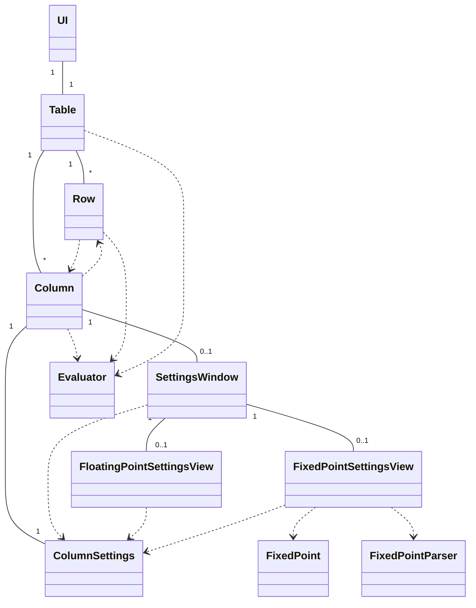
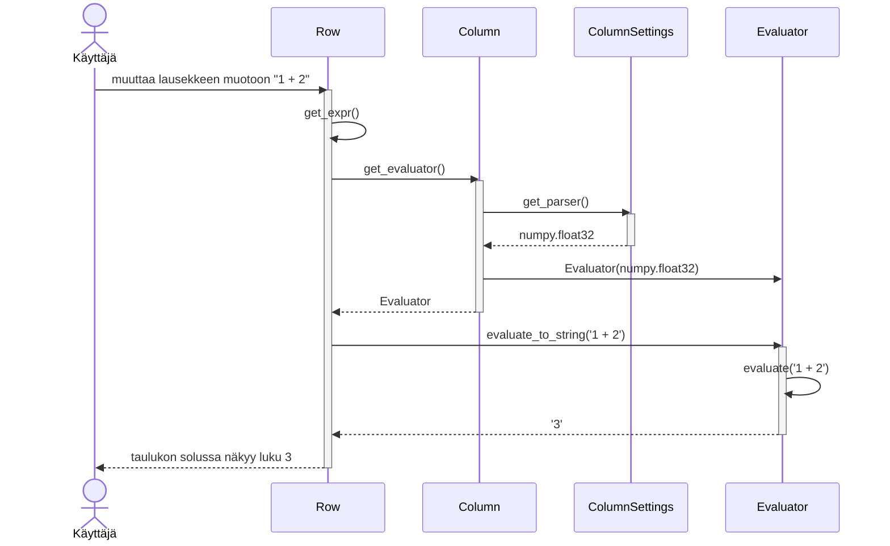

# Arkkitehtuurikuvaus

## Rakenne
Sovelluksen käyttöliittymä on pakkauksessa `ui`, joka on riippuvainen pakkauksesta `calculation`, joka sisältää laskimen sovelluslogiikan

## Lausekkeen jäsentäminen ja laskenta
`calculation`-pakkauksen luokka `Evaluator` jäsentää lausekkeen alilausekkeisiin, operaattoreihin ja *literaaleihin*. Se muuttaa jokaisen literaalin luvuksi kutsumalla funktiota, joka annettiin argumentiksi sen kostruktorille. Se ei oleta funktion palauttavan minkään tietyn tyyppistä lukua, mutta olettaa sen kuitenkin tukevan tiettyjä operaatioita, jotta lausekkeen arvo voidaan laskea. Tiettyjen esitysmuotojen toteutus on siis abstrahoitu eräänlaisen rajapinnan taakse, eikä `Evaluator`-luokan tarvitse tietää niistä.

## Eri esitysmuotojen toteutus
`calculation`-pakkauksessa on myös luokka `FixedPoint`, joka esittää kiintolukua, sekä luokka `FixedPointParser`, jonka avulla luvun merkkijonoesitys voidaan muuttaa kiintoluvuksi. `FixedPointParser`-luokan instanssi voidaan antaa parametrina `Evaluator`-luokan konstruktorille, jolloin se muuttaa lausekkeen literaalit `FixedPoint`-luokan instansseiksi. Liukulukulaskenta eri tarkkuuksilla on toteutettu käyttäen NumPy-kirjaston luokkia `float16`, `float32` ja `float64`. Nämä luokat voidaan antaa sellaisenaan `Evaluator`-luokan konstruktorille.

## Käyttöliittymä
Sovelluksen käyttöliittymän pääikkunasta vastaa luokka `UI`. Pääikkunassa on kaksi vierityspalkkia sekä taulukko, josta vastaa `Table`-luokka. Taulukon riveistä ja sarakkeista vastaavat luokat `Row` ja `Column`, ja sarakkeen asetuksia hallinnoi luokka `ColumnSettings`. Kun käyttäjä klikkaa sarakkeen otsikkoa, avautuu `SettingsWindow`-luokan hallitsema ikkuna. Tässä ikkunassa on kaksi mahdollista näkymää, joita vastaavat luokat `FixedPointSettingsView` ja `FloatingPointSettingsView`.

## Luokkarakenne
Edellä mainitut luokat liittyvät toisiinsa seuraavasti:

## Luokkien toiminta yhdessä
Oletetaan yksinkertaisuuden vuoksi, että taulukossa on yksi rivi ja yksi sarake, joka käyttää 32-bittisiä liukulukuja. Kun käyttäjä muuttaa lauseketetta tekstikentässä, suoritus etenee seuraavasti.

