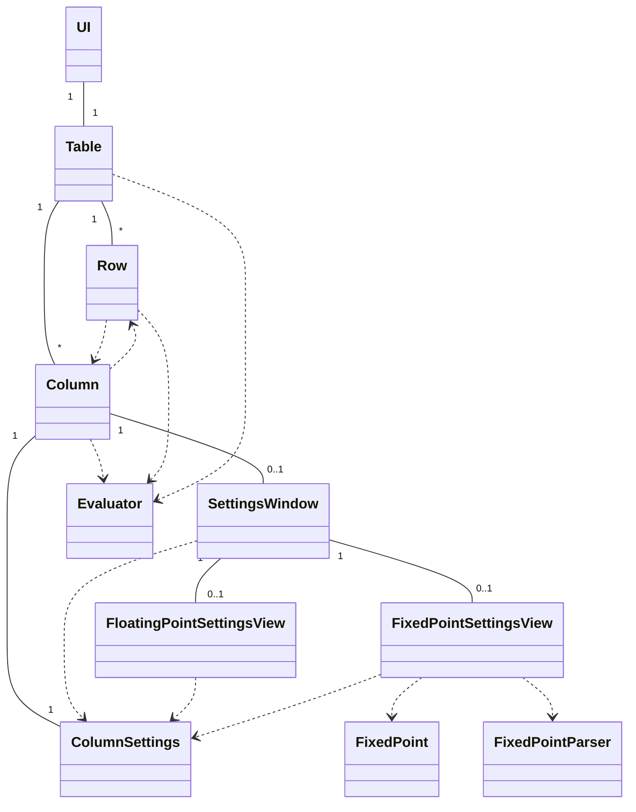
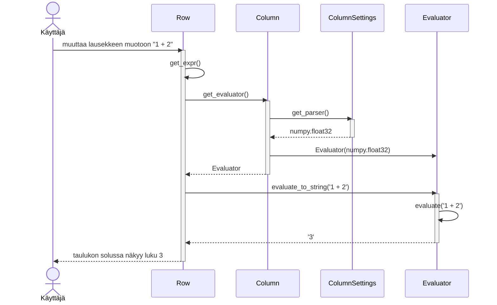

# Arkkitehtuurikuvaus

## Luokkarakenne
Sovelluksen toiminnallisuus ja käyttöliittymä on jaettu luokkiin seuraavasti:

## Toiminnallisuus

### Lausekkeen arvon laskeminen
Sekvenssikaavio tilaanteesta, jossa käyttäjä muuttaa lauseketta tekstikentässä, kun taulukossa on yksi rivi ja yksi sarake, joka käyttää 32-bittisiä liukulukuja:

