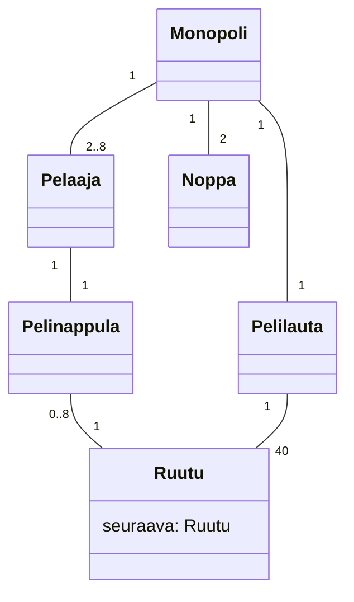

# Tehtävä 1: Monopoli

```mermaid
classDiagram
    Monopoli "1" -- "2..8" Pelaaja
    Monopoli "1" -- "1" Pelilauta
    Pelinappula "0..8" -- "1" Ruutu
    Pelilauta "1" -- "40" Ruutu
    Pelaaja "1" -- "1" Pelinappula
    Monopoli "1" -- "2" Noppa

    class Ruutu {
        seuraava: Ruutu
    }
```
