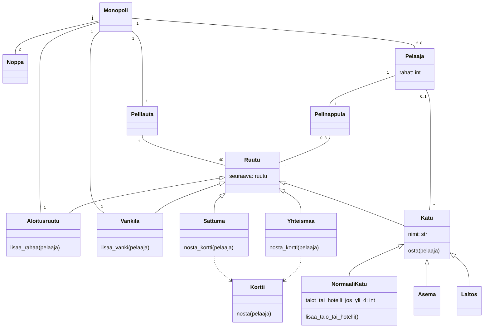

# Tehtävä 2: Laajennettu Monopoli

```mermaid
classDiagram
    Monopoli "1" -- "2" Noppa
    Monopoli "1" -- "2..8" Pelaaja
    Monopoli "1" -- "1" Pelilauta
    Pelilauta "1" -- "40" Ruutu
    Pelaaja "1" -- "1" Pelinappula
    Pelinappula "0..8" -- "1" Ruutu
    Monopoli "1" -- "1" Aloitusruutu
    Monopoli "1" -- "1" Vankila
    Ruutu <|-- Aloitusruutu
    Ruutu <|-- Vankila
    Ruutu <|-- Sattuma
    Ruutu <|-- Yhteismaa
    Ruutu <|-- Katu
    Katu <|-- NormaaliKatu
    Katu <|-- Asema
    Katu <|-- Laitos
    Sattuma ..> Kortti
    Yhteismaa ..> Kortti
    Pelaaja "0..1" -- "*" Katu

    class Ruutu {
        seuraava: ruutu
    }

    class Aloitusruutu {
        lisaa_rahaa(pelaaja)
    }

    class Vankila {
        lisaa_vanki(pelaaja)
    }

    class Sattuma {
        nosta_kortti(pelaaja)
    }

    class Yhteismaa {
        nosta_kortti(pelaaja)
    }

    class Katu {
        nimi: str
        osta(pelaaja)
    }
    
    class NormaaliKatu {
        talot_tai_hotelli_jos_yli_4: int
        lisaa_talo_tai_hotelli()
    }

    class Kortti {
        nosta(pelaaja)
    }

    class Pelaaja {
        rahat: int
    }
```
