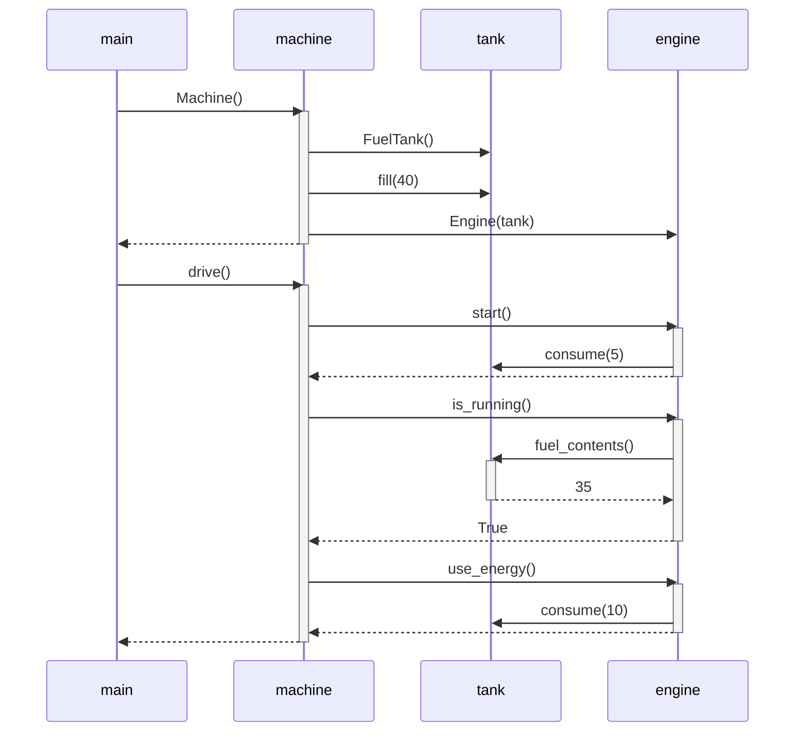

# Tehtävä 3: Sekvenssikaavio

```mermaid
sequenceDiagram
    main ->> machine: Machine()
    activate machine
    machine ->> tank: FuelTank()
    machine ->> tank: fill(40)
    machine ->> engine: Engine(tank)
    machine -->> main: 
    deactivate machine
    main ->> machine: drive()
    activate machine
    machine ->> engine: start()
    activate engine
    engine ->> tank: consume(5)
    engine -->> machine: 
    deactivate engine
    machine ->> engine: is_running()
    activate engine
    engine ->> tank: fuel_contents()
    activate tank
    tank -->> engine: 35
    deactivate tank
    engine -->> machine: True
    deactivate engine
    machine ->> engine: use_energy()
    activate engine
    engine ->> tank: consume(10)
    engine -->> machine: 
    deactivate engine
    machine -->> main: 
    deactivate machine
```
